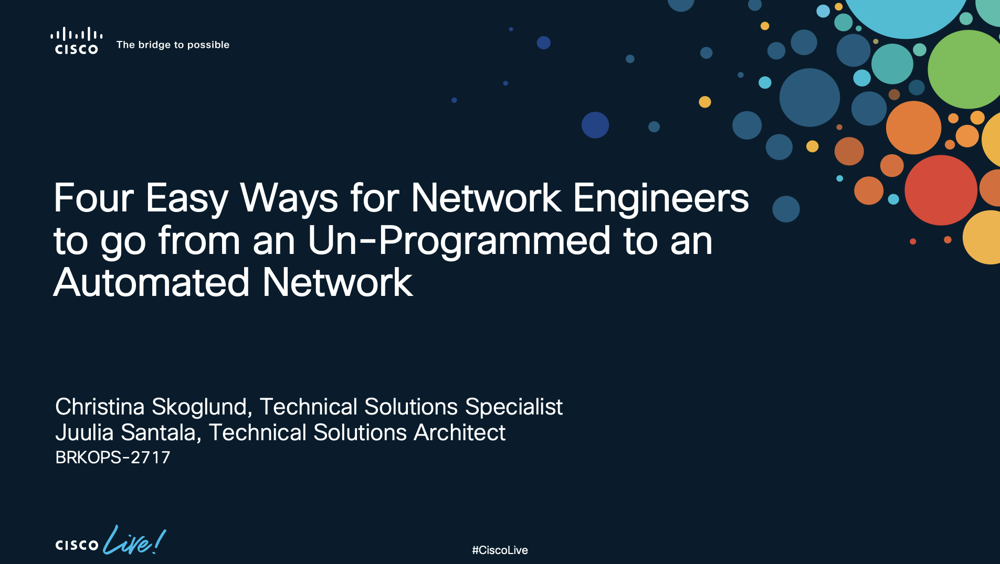

# The best time to start your **automation journey** is **now**!
*In this repository we are sharing all code that has been presented during the breakout session BRKOPS-2717 at Cisco Live 2022. The main goal with these scripts is to introduce Network Engineers to the power and possibilities of programmability by providing some simple examples.



## 4 easy ways towards automated network
* Automate [network changes](1_Network_Changes/README.md)
* Automate [change verification](2_Change_Verification/README.md)
* Automate [adding new capabilities](3_New_Capabilities/README.md)
* [Get started today!](4_Get_Started/README.md)

## Before you start
All of the code presented in the Cisco Live session is available for you on this Github repository. If you do not have programming experience before hand, there are couple of steps you will need to cover before you can start trying the examples out.

### Prepare your developer environment
- Install Python version 3
- Install Git
- Install Postman
- Install a code editor, for example Atom or VS Code

Not sure how to do these? DevNet has great learning material to get you through these steps. You will need a free DevNet account to access the material, so register [here](https://developer.cisco.com/) if you haven't, and enjoy the learning labs to get your developer environment started:

Windows: https://developer.cisco.com/learning/modules/dev-setup/dev-win/step/1
Mac: https://developer.cisco.com/learning/modules/dev-setup/dev-mac/step/1
Linux (CentOS): https://developer.cisco.com/learning/modules/dev-setup/dev-centos/step/1
Linux (Ubuntu): https://developer.cisco.com/learning/modules/dev-setup/dev-ubuntu/step/1

### Clone the repository and install required libraries
When you have your developer environment up and running, make sure you install all libraries and modules required for your scripts. To keep your developer environment tidy, make sure to activate your virtual environment before installing the libraries.

Clone this repository to the environment in which your are working:
```bash
git clone https://github.com/CiscoLearning/ciscolive-brkops-2717.git
```

Install the requirements to have all the necessary libraries for the code examples to work.

```bash
pip install -r requirements.txt 
```

## Authors & Maintainers
People responsible for the creation and maintenance of this project:
* Christina Skoglund cskoglun@cisco.com
* Juulia Santala jusantal@cisco.com

## License
This project is licensed to you under the terms of the [Cisco Sample Code License](LICENSE).